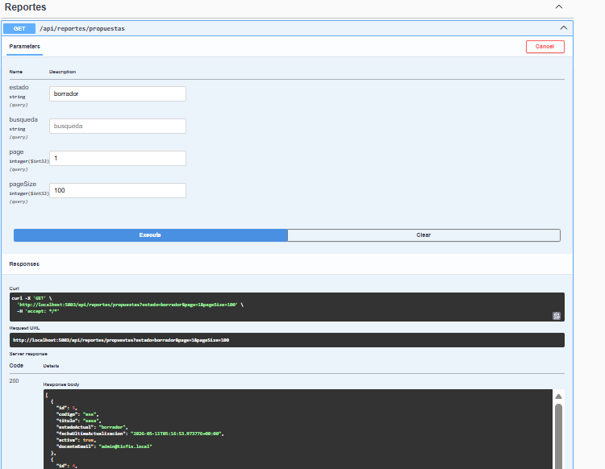
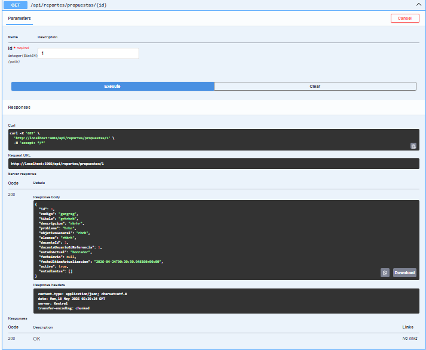
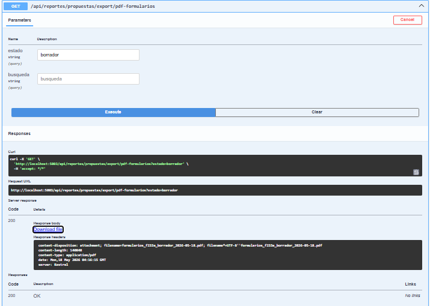
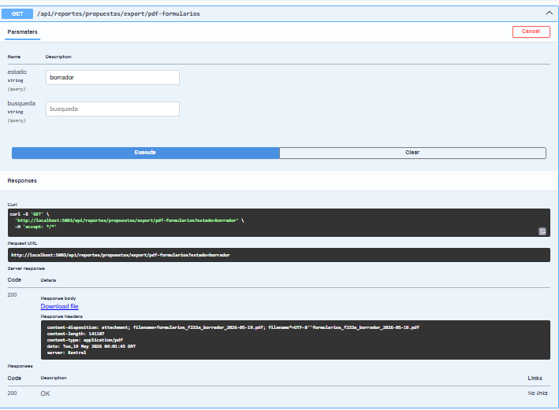
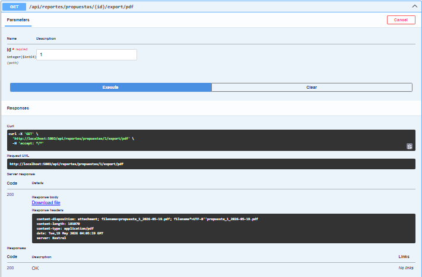
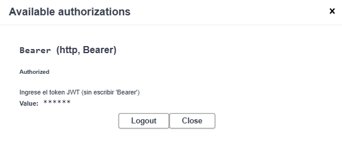

# Evidencia — Endpoints y capturas de Swagger UI

**Proyecto:** Módulo de Consultas y Reportes — Sistema web TIC-FIS
**Facultad de Ingeniería de Sistemas — Escuela Politécnica Nacional**
**Tipo de documento:** Evidencia complementaria del repositorio

---

## Introducción

Este documento reúne las capturas de la ejecución de los endpoints del Reportes Service
desde **Swagger UI**, junto con los encabezados y cuerpos de respuesta HTTP/JSON que las
acompañan. En el cuerpo principal de la tesis se conservan únicamente las figuras más
representativas (interfaces de usuario, diagramas y el PDF resultante); las capturas de
Swagger se trasladan aquí para reducir la extensión del documento **sin perder la
evidencia técnica**. Este material **no forma parte del documento principal de la tesis**.

> Las imágenes referenciadas se encuentran en `img/` de este directorio del repositorio.

---

## 1. Sprint 1 — Endpoint de listado de propuestas

- **Imagen:** `SPRINT1_Endpoints_Consulta_Reportes.png`

- **Endpoint:** `GET /api/reportes/propuestas`
- **Qué evidencia:** el endpoint documentado en Swagger UI retorna el arreglo de
  propuestas con la estructura del DTO `PropuestaReporteItemDto` definido en el sprint.
- **Resultado:** respuesta `HTTP 200` con el arreglo JSON paginado de propuestas.

## 2. Sprint 2 — Respuesta JSON del detalle de propuesta

- **Imagen:** `SPRINT2_Endpoint_Detalle_Propuesta.png`

- **Endpoint:** `GET /api/reportes/propuestas/{id}`
- **Qué evidencia:** el cuerpo JSON devuelto incluye los campos del contrato
  `PropuestaReporteDetalleDto` con código `200 OK`. Algunos campos aparecen nulos
  (p. ej. `fechaEnvio`, `estudiantes`) porque la propuesta aún no tenía estudiantes
  asignados (0/5), lo que validó la tolerancia a nulos en la deserialización.
- **Resultado:** serialización correcta del modelo hacia el consumidor de la API.

## 3. Sprint 5 — Exportación del reporte PDF resumen

- **Imagen:** `SPRINT2_Exportacion_PDF_Swagger.png`

- **Endpoint:** `GET /api/reportes/propuestas/export/pdf` (con el filtro de disponibilidad activo)
- **Qué evidencia:** la respuesta `200 OK` incluye `Content-Disposition: attachment`,
  un nombre de archivo generado dinámicamente con la fecha (`YYYY-MM-DD`) y tipo MIME
  `application/pdf` (~65 KB).
- **Resultado:** generación correcta del binario PDF desde la infraestructura (QuestPDF).

## 4. Sprint 6 — Exportación del formulario F_AA_233A multipágina

- **Imagen:** `SPRINT6_Swagger_FormulariosPDF.png`

- **Endpoint:** `GET /api/reportes/propuestas/export/pdf-formularios` (con el filtro de disponibilidad activo)
- **Qué evidencia:** respuesta `200 OK` con `Content-Type: application/pdf`,
  `Content-Disposition: attachment` y tamaño `141 187` bytes.
- **Resultado:** generación correcta del documento multipágina en memoria.

## 5. Sprint 6 — Exportación del PDF de detalle individual

- **Imagen:** `SPRINT6_Swagger_DetallePDF.png`

- **Endpoint:** `GET /api/reportes/propuestas/{id}/export/pdf` (propuesta id = 1)
- **Qué evidencia:** respuesta con `Content-Type: application/pdf`,
  `content-length: 180 570` bytes y nombre `propuesta_1_2026-05-19.pdf`.
- **Resultado:** generación correcta del PDF de detalle de una propuesta específica.

## 6. Sprint 0 — Autorización JWT Bearer en Swagger UI

- **Imagen:** `SPRINT0_Swagger_JWT_Autorizacion.png`

- **Qué evidencia:** el modal de autorización de Swagger UI con el esquema Bearer
  configurado y la sesión JWT activa, que mantiene el token durante toda la sesión sin
  reconfigurarlo en cada solicitud.
- **Resultado:** facilita las pruebas interactivas de los endpoints protegidos durante el
  desarrollo.

---

> **Nota aclaratoria:** este documento es un respaldo técnico complementario del
> repositorio del proyecto y **no forma parte del cuerpo principal de la tesis**. Las
> validaciones funcionales de estos endpoints se resumen en el Capítulo 3 de la tesis
> (Pruebas funcionales).
