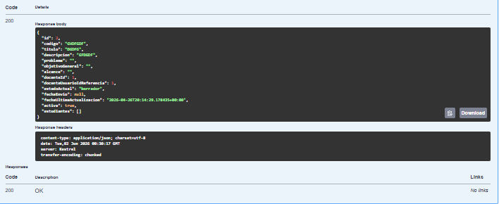
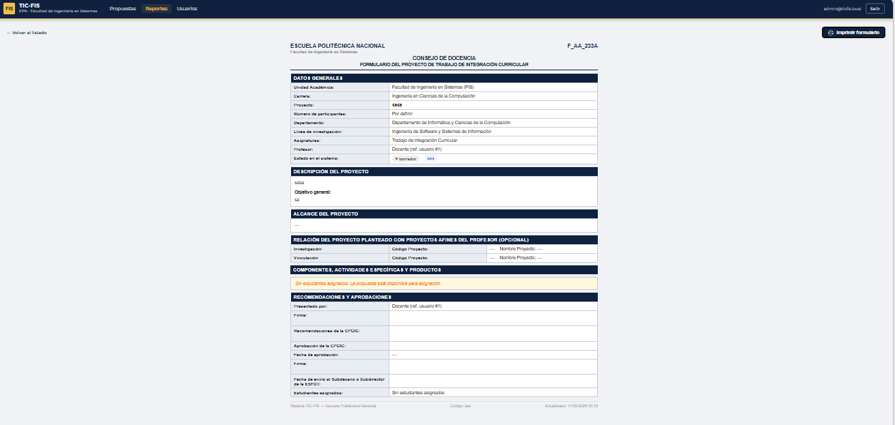
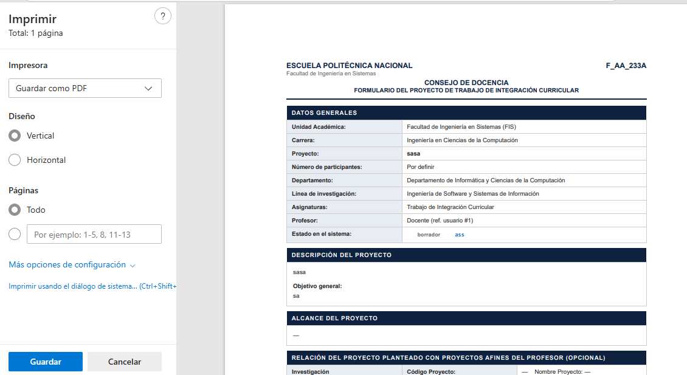
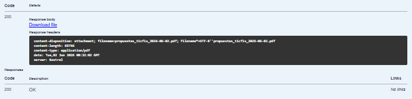
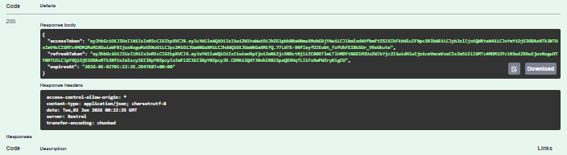
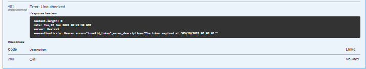
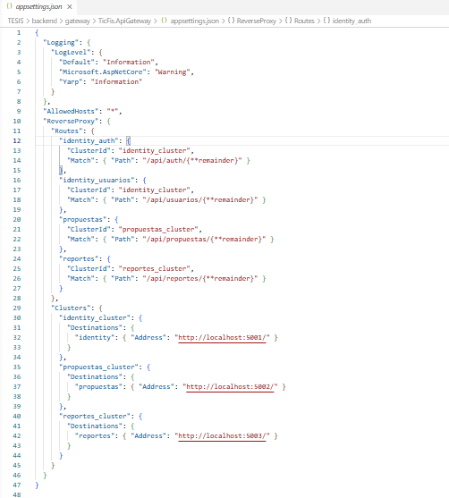
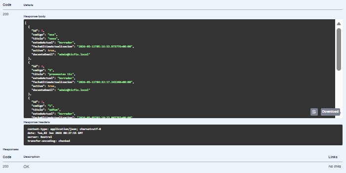
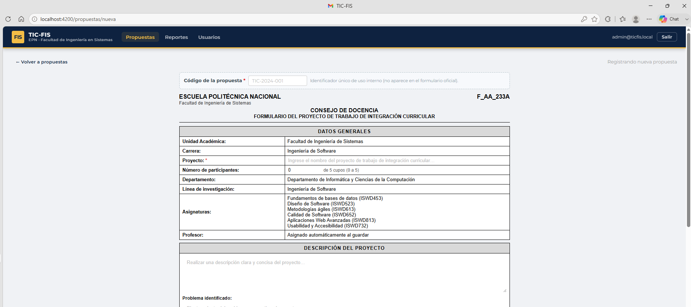
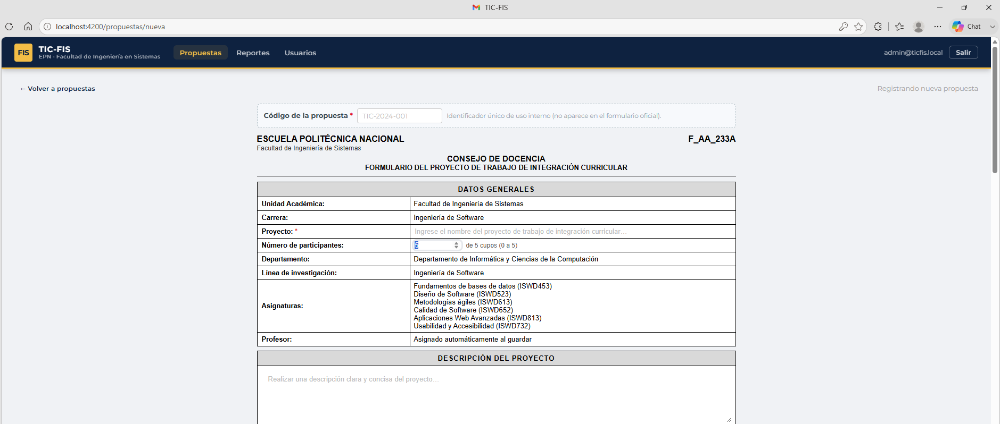

# Evidencia — Pruebas funcionales (procedimiento detallado)

**Proyecto:** Módulo de Consultas y Reportes — Sistema web TIC-FIS
**Facultad de Ingeniería de Sistemas — Escuela Politécnica Nacional**
**Tipo de documento:** Evidencia complementaria del repositorio

---

## Introducción

Este documento conserva el procedimiento paso a paso y las capturas de las pruebas
funcionales del módulo. En el cuerpo principal de la tesis se presenta en detalle la
**prueba representativa** (consulta del listado de propuestas) y se resume el resto en
una tabla; aquí se preserva el detalle completo de las pruebas 2 a 6 como respaldo
técnico que **no forma parte del documento principal de la tesis**.

Todas las pruebas se ejecutaron con la técnica de caja negra sobre el entorno de
desarrollo local, usando Swagger UI sobre la API y Google Chrome para la interfaz
Angular. Las imágenes referenciadas se encuentran en `img/` de este directorio.

---

## Prueba 2 — Consulta del detalle (Formulario F_AA_233A)

**Objetivo:** verificar que `GET /api/reportes/propuestas/{id}` retorne el DTO completo
de una propuesta y que la interfaz Angular renderice el formulario F_AA_233A íntegro,
con opción de imprimir o exportar a PDF.

**Ejecución:**
1. En Swagger UI del Reportes Service (puerto 5003), se ejecutó `GET /api/reportes/propuestas/{id}` con el identificador de una propuesta existente.
2. La respuesta `HTTP 200` incluyó el DTO completo con todos los campos de la propuesta y el arreglo `estudiantes[]`.
3. Se navegó a la interfaz Angular y se seleccionó la misma propuesta desde la tabla.
4. El sistema renderizó el formulario F_AA_233A con encabezado EPN y todas sus secciones.
5. Se verificaron las secciones: Datos Generales, Descripción, Alcance, Relación con Proyectos, Componentes, Recomendaciones y Aprobaciones.
6. Se hizo clic en «Imprimir formulario»: se abrió el diálogo de impresión con la vista previa.
7. Se confirmó la disponibilidad de «Guardar como PDF» en el selector de destino.

**Evidencia:** `foto4_detalle_propuesta.png` (respuesta JSON del endpoint),

`foto8_formulario_f233a.png` (formulario completo en Angular),

`foto9_impresion_formulario.png` (diálogo de impresión con «Guardar como PDF»).

**Resultado:** el endpoint retornó el DTO completo; el formulario se renderizó íntegro
con todas las secciones pobladas y la exportación a PDF disponible. **Prueba exitosa.**

---

## Prueba 3 — Exportación de reporte PDF

**Objetivo:** verificar la correcta generación y entrega del reporte PDF mediante
`GET /api/reportes/propuestas/export/pdf` (QuestPDF), sin escritura en disco.

**Ejecución:**
1. En Swagger UI del Reportes Service (puerto 5003), se configuró el esquema Bearer con el token JWT activo.
2. Se ejecutó `GET /api/reportes/propuestas/export/pdf`.
3. La respuesta incluyó `HTTP 200` con los encabezados `Content-Type: application/pdf`, `Content-Disposition: attachment` y `Content-Length: 69748`.
4. Se verificó que el cuerpo contenía datos binarios válidos de un PDF generado por QuestPDF en tiempo real.
5. Se confirmó que el servidor no escribe el archivo en disco: se construye en memoria y se serializa al flujo de respuesta HTTP.

**Evidencia:** `foto5_export_pdf.png` (respuesta HTTP 200 con los encabezados y los

69 748 bytes).

**Resultado:** documento PDF generado y entregado correctamente, en memoria, apropiado
para un microservicio sin estado. **Prueba exitosa.**

---

## Prueba 4 — Autenticación con Access Token (JWT)

**Objetivo:** verificar que el control de acceso JWT rechace las solicitudes sin
credenciales y atienda las que presentan un token válido emitido por el Identity Service.

**Ejecución:**
1. Se accedió al Identity Service (Swagger UI, puerto 5001).
2. Se ejecutó `POST /api/auth/login` con credenciales válidas del sistema TIC-FIS.
3. La respuesta `HTTP 200` incluyó `accessToken` y `refreshToken`.
4. Se copió el `accessToken`.
5. En el Reportes Service (puerto 5003) se ejecutó `GET /api/reportes/propuestas` **sin** token.
6. El sistema retornó `HTTP 401 Unauthorized` (middleware de ASP.NET Core).
7. Se configuró el esquema Bearer con el `accessToken` obtenido.
8. Se repitió la solicitud con el token activo.
9. El sistema retornó `HTTP 200` con el arreglo de propuestas.

**Evidencia:** `foto1_login_exitoso.png` (emisión de tokens),

`foto2_sin_token_401.png` (respuesta 401 sin token).

**Resultado:** solo las solicitudes autenticadas acceden a la información; valida la
integración Identity Service ↔ Reportes Service. **Prueba exitosa.**

---

## Prueba 5 — Enrutamiento con API Gateway (YARP)

**Objetivo:** comprobar que el API Gateway (puerto 5000) enrute cada solicitud al
microservicio correcto y retransmita la respuesta sin alteraciones.

**Ejecución:**
1. Se verificó que el API Gateway estuviera activo en `http://localhost:5000`.
2. Se configuró la herramienta HTTP para apuntar al puerto del gateway.
3. Se ejecutó `GET http://localhost:5000/api/reportes/propuestas` con `Authorization: Bearer {token}`.
4. El gateway identificó el prefijo `/api/reportes` y enrutó al Reportes Service (5003) según las reglas YARP.
5. El Reportes Service procesó la petición y retornó la respuesta al gateway.
6. El gateway retransmitió la respuesta con el mismo código HTTP y cuerpo JSON.
7. Se comparó la respuesta vía gateway con la directa del Reportes Service: equivalentes.

**Evidencia:** `foto_gateway_enrutamiento.png` (configuración YARP: `/api/reportes/{**remainder}`

→ `reportes_cluster` → `http://localhost:5003/`).

**Resultado:** enrutamiento transparente, sin alteración de código HTTP, encabezados ni
cuerpo; el token se propagó íntegro. **Prueba exitosa.**

---

## Prueba 6 — Composición de datos (API Composition)

**Objetivo:** verificar que el Reportes Service construya sus respuestas componiendo en
tiempo real los datos del Propuestas Service, sin réplica local y propagando el JWT.

**Ejecución:**
1. Se autenticó en el Identity Service (5001) y se obtuvo un token JWT (`POST /api/auth/login`).
2. Se ejecutó `GET /api/reportes/propuestas` en el Reportes Service (5003) con el Bearer token.
3. Internamente, el Reportes Service inyectó el mismo token en una solicitud HTTP al Propuestas Service (5002).
4. El Propuestas Service validó el token propagado y retornó el listado.
5. El Reportes Service aplicó el mapeo al DTO y los filtros sobre los datos recibidos.
6. El resultado se retornó al cliente con `HTTP 200` según el contrato de la API.
7. Se verificó que el Reportes Service no posee tabla de propuestas propia: toda la información proviene del Propuestas Service en cada solicitud.

**Evidencia:** `foto3_listado_propuestas.png` (resultado compuesto en tiempo real).

**Resultado:** composición correcta, con fuente única de verdad en el servicio de origen
y JWT propagado sin exponerlo ni almacenarlo. Es la validación funcional más
representativa de la integración entre microservicios. **Prueba exitosa.**

---

## Anexo — Preparación de los datos de prueba

> **Nota de alcance:** el registro de propuestas pertenece al **módulo de Propuestas**
> del sistema TIC-FIS, no al módulo de Consultas y Reportes documentado en esta tesis.
> Las siguientes capturas se incluyen únicamente como respaldo del **origen de los datos**
> utilizados en las pruebas del módulo de Reportes.

Para las pruebas, las propuestas se registran con el formato del formulario F\_AA\_233A.
Una propuesta nueva queda con cupo inicial **0/5** cuando no se asignan estudiantes, y el
sistema admite un **máximo de cinco estudiantes** por propuesta, valor a partir del cual
deja de considerarse disponible. Esto explica por qué el módulo de Reportes muestra cada
propuesta con su número de cupos y su disponibilidad.

**Registro de propuesta (cupo inicial 0/5):**

**Validación del máximo de cinco estudiantes:**

---

> **Nota aclaratoria:** este documento es un respaldo técnico complementario del
> repositorio del proyecto y **no forma parte del cuerpo principal de la tesis**. En la
> tesis, estas pruebas se sintetizan en la tabla "Resumen de las pruebas funcionales
> ejecutadas sobre el módulo" del Capítulo 3.
