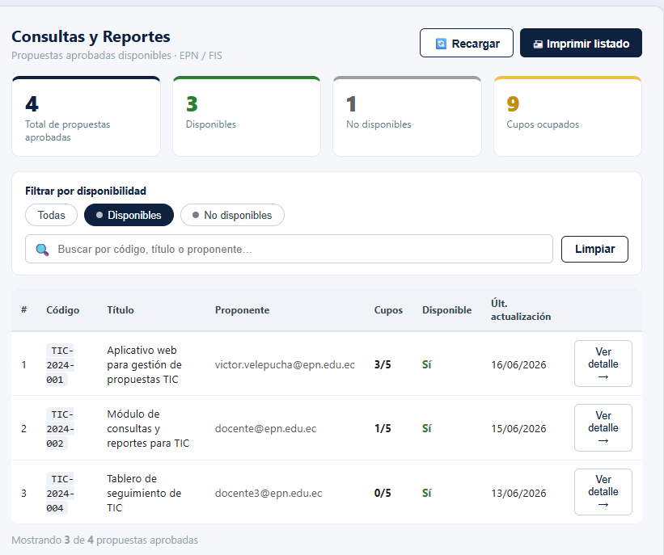
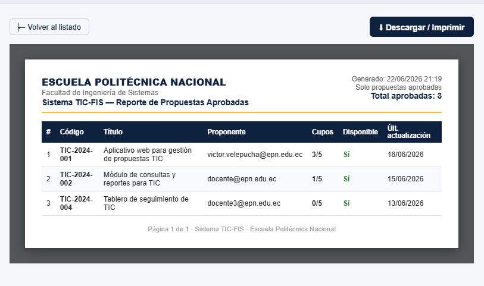
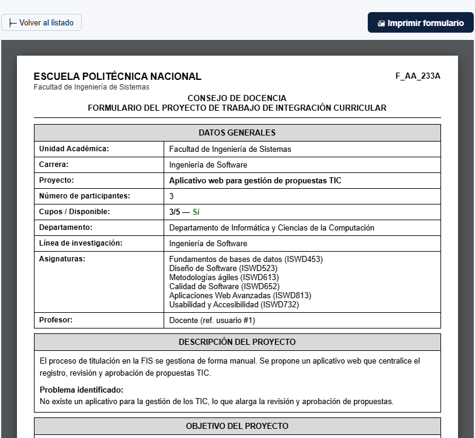

# Prototipos de Interfaces (Figma)

**Proyecto:** Módulo de Consultas y Reportes — Sistema web TIC-FIS
**Facultad de Ingeniería de Sistemas — Escuela Politécnica Nacional**
**Tipo de documento:** Evidencia complementaria del repositorio

---

Prototipos de alta fidelidad del Módulo de Consultas y Reportes diseñados en **Figma**,
correspondientes a las pantallas principales del módulo.

## Pantalla principal

## Imprimir listado

## Imprimir formulario

