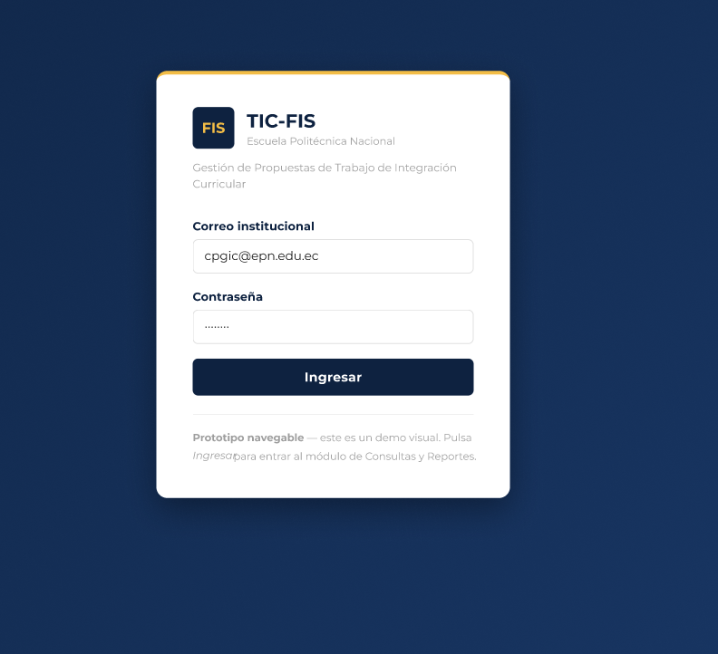
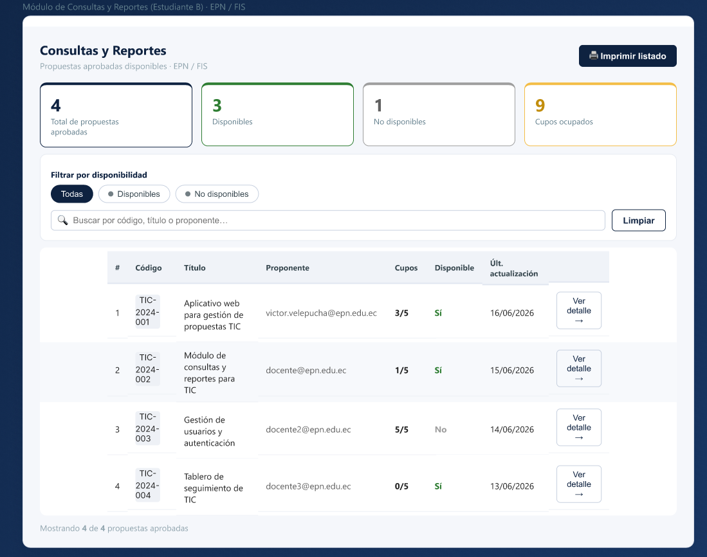

# Prototipos de Interfaces (Figma)

**Proyecto:** Módulo de Consultas y Reportes — Sistema web TIC-FIS
**Facultad de Ingeniería de Sistemas — Escuela Politécnica Nacional**
**Tipo de documento:** Evidencia complementaria del repositorio

---

Prototipos de alta fidelidad del Módulo de Consultas y Reportes diseñados en **Figma**,
correspondientes a las pantallas principales del módulo.

## Pantalla 1 — Inicio de sesión

## Pantalla 2 — Consultas y reportes

## Pantalla 3 — Propuestas disponibles

## Pantalla 4 — Propuestas no disponibles

## Pantalla 5 — Propuestas no disponibles (detalle)

## Pantalla 6 — Aviso de impresión PDF

## Pantalla 7 — Impresión PDF realizada con éxito

